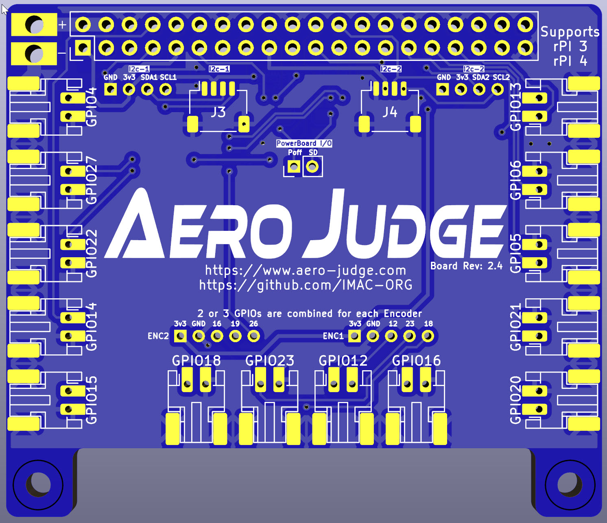
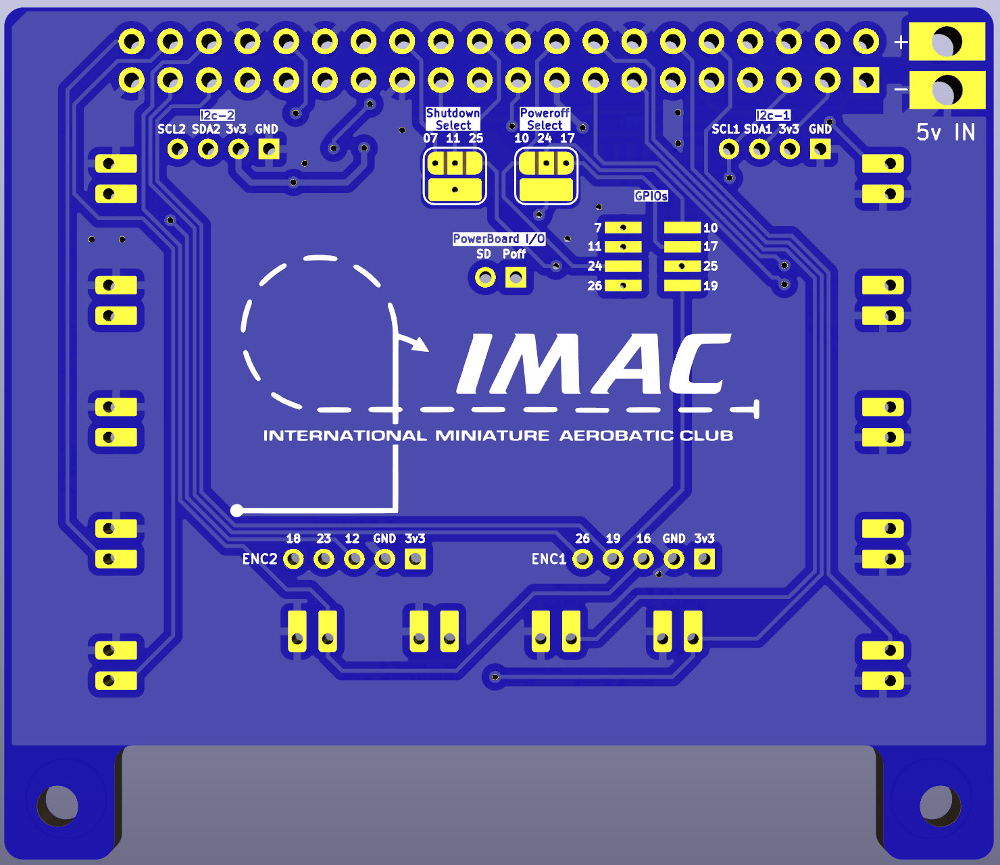

# AeroJudge PCB

Here you will find details and source files for the aerojudge main PCB.  This PCB can be used standalone or together with the Aerojudge Power PCB.
<picture>
  <source
    srcset="AeroJudge_PCB_Top.jpg"
    media="(orientation: landscape)" />
  
</picture>
<picture>
  <source
    srcset="AeroJudge_PCB_Bottom.jpg"
    media="(orientation: landscape)" />
  
</picture>

## ToDo
 - (maybe) Flip the text on the front
 - Replace JST-SH-4P + GPIO pins with a single JST-6P in either SH or PH (also for powerboard).
 - Remove i2c 2mm headers (if we use JST-PH above).
 - Adjust PH 2P button headers (footprint isn't 100% correct for SMD)