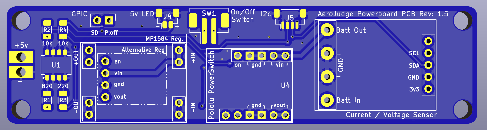
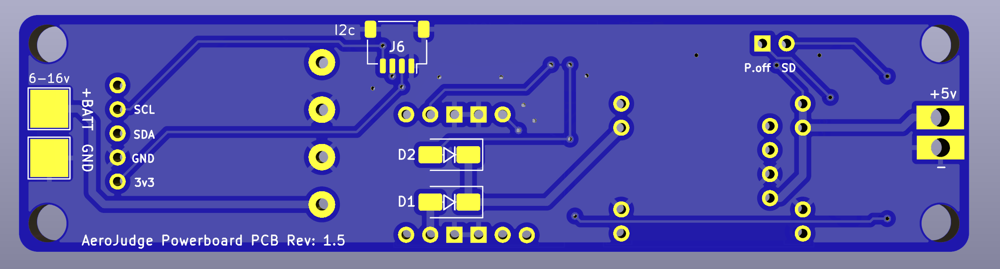

# AeroJudge PCB

<picture>
  <source
    srcset="../..//Media/AeroJudge%20Logo/AeroJudge%20Logo.jpg"
    media="(orientation: landscape)" />
  
</picture>
 

Here you will find details and source files for the aerojudge powerboard PCB.  This PCB is used to house the power components of the device.

<picture>
  <source
    srcset="AeroJudge_Powerboard_PCB_Top.png"
    media="(orientation: landscape)" />
  
</picture>
<picture>
  <source
    srcset="AeroJudge_Powerboard_PCB_Bottom.png"
    media="(orientation: landscape)" />
  
</picture>
 

   
